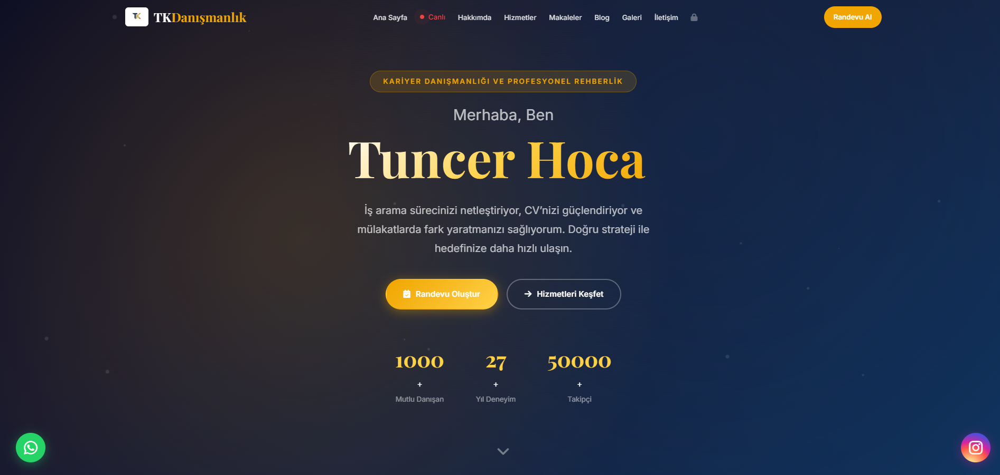
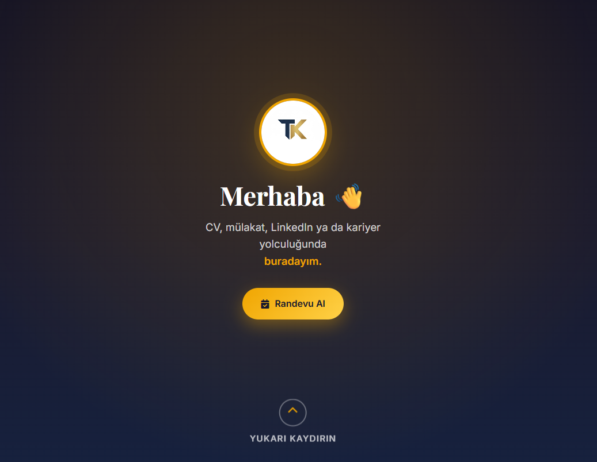

<div align="center">

# 💼 Danışmanlık Sitesi — TuncerYazıyor.com

**Bireysel danışman için randevu + online ödeme + blog sitesi**

Tanıtım, blog, online randevu ve **iyzico ile ödeme** içeren,
yönetim panelli profesyonel danışmanlık web sitesi.


</div>

---

## 📖 Genel Bakış

Bireysel bir danışmanın hizmetlerini tanıttığı, içerik paylaştığı ve ziyaretçilerin **online randevu alıp ödeme yapabildiği** profesyonel bir web sitesidir. Koyu temalı, tek sayfa (one-page) tanıtım sitesi + blog + tam donanımlı yönetim paneli içerir.

## 📸 Ekran Görüntüleri

<div align="center">

| Ana Sayfa | Karşılama | Açılış |
|:--:|:--:|:--:|
|  |  |  |

</div>

## ✨ Özellikler

- 🏠 **Tek sayfa tanıtım** — hero, hakkımda, hizmetler (fiyatlı), yorumlar, iletişim
- 📅 **Randevu + Ödeme** — hizmet seçimi → iyzico Checkout Form → onay
- 📝 **Blog** — liste + detay görünümü (admin'den yönetilir)
- 🔐 **Yönetim paneli** — dashboard (istatistikler), blog CRUD, randevu yönetimi
- ✉️ **İletişim & bülten** — mesaj kaydı + e-posta aboneliği
- 📱 Mobil uyumlu, animasyonlu (saf JS — framework yok)

## 🛠️ Teknolojiler

`HTML5` · `CSS3` · `Vanilla JavaScript` · `PHP (PDO)` · `MySQL` · `iyzico Checkout Form API` · `Font Awesome` · `Apache (.htaccess)`

## 📄 Sayfalar

| Sayfa | İşlev |
|---|---|
| `index.html` | Ana tek-sayfa site (hero · hizmetler · randevu · ödeme · iletişim) |
| `blog.html` | Blog listesi ve `?id=` ile yazı detayı |
| `admin.html` | Şifre korumalı yönetim paneli |
| `odeme-basarili.html` / `odeme-basarisiz.html` | Ödeme sonuç sayfaları |

---

## 🚀 Kurulum

### Gereksinimler
- PHP (cURL uzantısı) + MySQL · Apache önerilir

### Adımlar
1. `includes/config.example.php` → **`includes/config.php`** olarak kopyala ve doldur:
   - **DB:** `DB_HOST`, `DB_NAME`, `DB_USER`, `DB_PASS`
   - **Site:** `SITE_URL`, `SITE_NAME`
   - **Admin:** `ADMIN_USER`, `ADMIN_PASS` (mutlaka değiştir)
   - **iyzico:** `IYZICO_API_KEY`, `IYZICO_SECRET_KEY`, `IYZICO_BASE_URL`
     (test: `https://sandbox-api.iyzipay.com`, canlı: `https://api.iyzipay.com`)
2. Tarayıcıdan **`install.php`**'yi bir kez çalıştır → veritabanı + 4 tablo + örnek blog oluşturulur.
3. **`install.php`'yi sil** (güvenlik).
4. Yayınla → `index.html` ana giriş, `admin.html` yönetim.

> Yerel test: proje kökünde `php -S localhost:8000`. `config.php` olmadan API'ler çalışmaz.

---

## 🏛️ Yapı

```
Danismanlik-Sitesi/
├── index.html · blog.html · admin.html
├── odeme-basarili.html · odeme-basarisiz.html
├── install.php              → tek seferlik kurulum (DB + tablolar + örnek veri)
├── .htaccess                → güvenlik · gzip · cache
├── api/                     → blog · appointments · contact · payment(iyzico) · login
├── includes/                → config · db (PDO) · auth
├── css/style.css
└── js/main.js               → animasyon · formlar · ödeme · blog yükleme
```

**Veritabanı:** `blog_posts` · `appointments` · `contact_messages` · `newsletter`

## 🔒 Notlar

- Ödeme **iyzico Checkout Form** ile yapılır (IYZWSv2 / HMAC-SHA256 imzalı).
- `includes/config.php` gizli bilgiler içerdiği için repoya **dahil edilmez** (`.gitignore`).
- Üretim öncesi: `.htaccess`'teki HTTPS/www yönlendirmelerini aç, admin şifresini güçlü yap.

## 📄 Lisans

Bu proje bir müşteri için özel olarak geliştirilmiştir. Portfolyo amaçlı sergilenmektedir; izinsiz çoğaltılamaz/yeniden dağıtılamaz.
